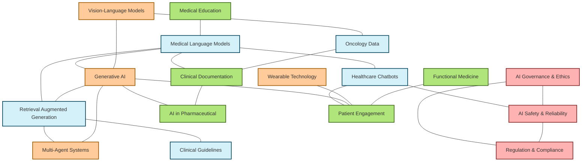

# NLP Summit Healthcare 2025 Knowledge Graph

## Topic Relationships

```mermaid
graph TD
    %% Main Topic Nodes
    MEDLLM[Medical Language Models]
    VISLLM[Vision-Language Models]
    CHATBOT[Healthcare Chatbots]
    ETHICS[AI Governance & Ethics]
    GENAI[Generative AI]
    RAG[Retrieval Augmented Generation]
    DOC[Clinical Documentation]
    SAFETY[AI Safety & Reliability]
    REG[Regulation & Compliance]
    WEAR[Wearable Technology]
    PHARMA[AI in Pharmaceutical]
    EDU[Medical Education]
    ENGAGE[Patient Engagement]
    FUNC[Functional Medicine]
    GUIDE[Clinical Guidelines]
    ONC[Oncology Data]
    AGENT[Multi-Agent Systems]
    
    %% Connections between topics
    MEDLLM --- CHATBOT
    MEDLLM --- DOC
    MEDLLM --- GENAI
    MEDLLM --- RAG
    
    VISLLM --- GENAI
    VISLLM --- ONC
    
    CHATBOT --- ENGAGE
    CHATBOT --- SAFETY
    
    ETHICS --- SAFETY
    ETHICS --- REG
    
    GENAI --- RAG
    GENAI --- ENGAGE
    GENAI --- PHARMA
    
    RAG --- AGENT
    RAG --- GUIDE
    
    DOC --- PHARMA
    
    SAFETY --- REG
    
    WEAR --- ENGAGE
    
    EDU --- MEDLLM
    
    FUNC --- ENGAGE
    
    ONC --- DOC
    
    AGENT --- GENAI
    
    %% Colors for categories
    classDef nlp fill:#D4F1F9,stroke:#05445E,stroke-width:2px
    classDef healthcare fill:#B0E57C,stroke:#3F681C,stroke-width:2px
    classDef technology fill:#FFCB9A,stroke:#9E5A00,stroke-width:2px
    classDef research fill:#FEB2B2,stroke:#822727,stroke-width:2px
    
    %% Assign classes
    class MEDLLM,CHATBOT,RAG,GUIDE,ONC nlp
    class DOC,FUNC,PHARMA,EDU,ENGAGE healthcare
    class GENAI,VISLLM,WEAR,AGENT technology
    class ETHICS,SAFETY,REG research
```

## Session Distribution by Day and Track

```mermaid
graph TD
    %% Main Day Nodes
    D1[Day 1: April 1, 2025]
    D2[Day 2: April 2, 2025]
    
    %% Tracks
    T1A[Track A]
    T1B[Track B]
    T1C[Track C]
    T2A[Track A]
    T2B[Track B]
    T2C[Track C]
    
    %% Connect days to tracks
    D1 --- T1A
    D1 --- T1B
    D1 --- T1C
    D2 --- T2A
    D2 --- T2B
    D2 --- T2C
    
    %% Sessions for Day 1
    S1_1[David Talby: Medical LLMs]
    S1_2[Kazemzadeh/Steiner: Vision-Language Models]
    S1_3[Michael Ash: Functional Medicine]
    S1_4[Chris Markson: Generative AI]
    S1_5[Reyes/Trambitas: Clinical Guidelines]
    
    %% Sessions for Day 2
    S2_1[Veysel Kocaman: Medical LLMs Benchmarks]
    S2_2[Shreya Rajpal: AI Guardrails]
    S2_3[Krishnaram Kenthapadi: Trustworthy AI]
    S2_4[Louis Ehwerhemuepha: LLM Bias Testing]
    S2_5[Yishay Carmiel: Audio Deepfakes]
    
    %% Connect sessions to days
    D1 --- S1_1
    D1 --- S1_2
    D1 --- S1_3
    D1 --- S1_4
    D1 --- S1_5
    
    D2 --- S2_1
    D2 --- S2_2
    D2 --- S2_3
    D2 --- S2_4
    D2 --- S2_5
    
    %% Colors
    classDef day1 fill:#FFE6CC,stroke:#D79B00,stroke-width:2px
    classDef day2 fill:#DAE8FC,stroke:#6C8EBF,stroke-width:2px
    classDef track fill:#D5E8D4,stroke:#82B366,stroke-width:2px
    
    %% Assign colors
    class D1,S1_1,S1_2,S1_3,S1_4,S1_5 day1
    class D2,S2_1,S2_2,S2_3,S2_4,S2_5 day2
    class T1A,T1B,T1C,T2A,T2B,T2C track
```

## Organization Relationships

```mermaid
graph TD
    %% Main Organizations
    JSL[John Snow Labs]
    GOOGLE[Google]
    AMAZON[Amazon/AWS]
    ORACLE[Oracle]
    ACADEMIC[Academic Institutions]
    HEALTHCARE[Healthcare Providers]
    PHARMA[Pharmaceutical Companies]
    
    %% Speakers and connections
    JSL --- TALBY[David Talby]
    JSL --- KOCAMAN[Veysel Kocaman]
    JSL --- JAIN[Ritwik Jain]
    JSL --- TRAMBITAS[Dia Trambitas]
    JSL --- DIXIT[Shubanshu Dixit]
    
    GOOGLE --- KAZEMZADEH[Sahar Kazemzadeh]
    GOOGLE --- STEINER[Andreas Steiner]
    
    AMAZON --- HADDAD[Chris Haddad]
    AMAZON --- TSE[Beau Tse]
    
    ORACLE --- KENTHAPADI[Krishnaram Kenthapadi]
    
    ACADEMIC --- DING[Ying Ding]
    ACADEMIC --- RUSNACHENKO[Nicolay Rusnachenko]
    ACADEMIC --- FAYYAZ[Jabeen Fayyaz]
    ACADEMIC --- VENUGOPAL[Vasantha Kumar Venugopal]
    
    HEALTHCARE --- ANG[Yee Ang]
    HEALTHCARE --- GOLD[Jonathan Gold]
    HEALTHCARE --- EHWERHEMUEPHA[Louis Ehwerhemuepha]
    HEALTHCARE --- YADAV[Vivek Yadav]
    HEALTHCARE --- BANERJEE[Ayindri Banerjee]
    
    PHARMA --- KONINTI[Shravan Koninti]
    PHARMA --- NAROTE[Devdatta Narote]
    PHARMA --- KOPPICHETTI[Ravi Kiran Koppichetti]
    
    %% Colors
    classDef org fill:#E1D5E7,stroke:#9673A6,stroke-width:2px
    classDef speaker fill:#FFF2CC,stroke:#D6B656,stroke-width:2px
    
    %% Assign colors
    class JSL,GOOGLE,AMAZON,ORACLE,ACADEMIC,HEALTHCARE,PHARMA org
    class TALBY,KOCAMAN,JAIN,KAZEMZADEH,STEINER,HADDAD,TSE,KENTHAPADI,DING,RUSNACHENKO,FAYYAZ,VENUGOPAL,ANG,GOLD,EHWERHEMUEPHA,YADAV,BANERJEE,KONINTI,NAROTE,KOPPICHETTI,TRAMBITAS,DIXIT speaker
```
